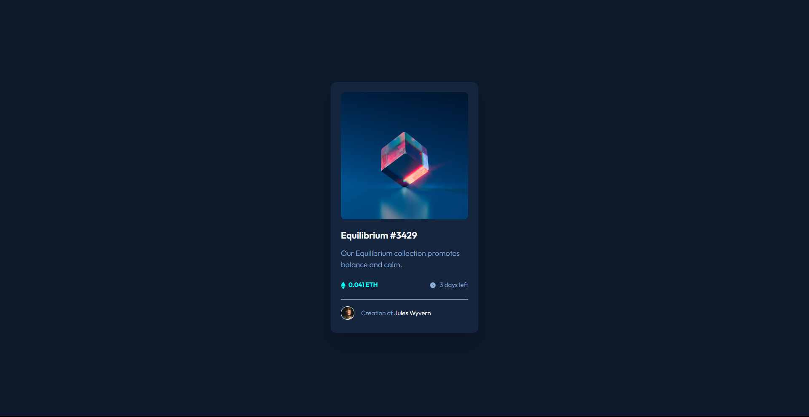

# Frontend Mentor - NFT preview card component solution

This is a solution to the [NFT preview card component challenge on Frontend Mentor](https://www.frontendmentor.io/challenges/nft-preview-card-component-SbdUL_w0U)

Compared to other challenges, i have now learned alot and i feel pretty good about this on, i got a feeling that it's a decent solution.

### Screenshot

### Built with

- Flexbox
- Semantic HTML5 markup
- Desktop-first workflow

### Links

- Solution URL: [Add solution URL here](https://your-solution-url.com)
- Live Site URL: [Add live site URL here](https://your-live-site-url.com)
